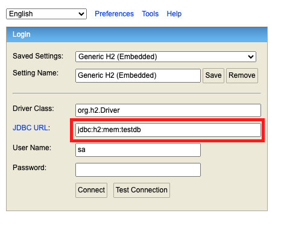
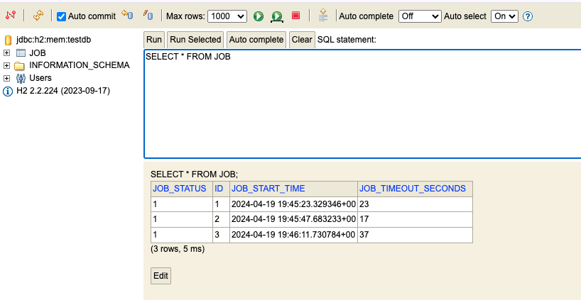
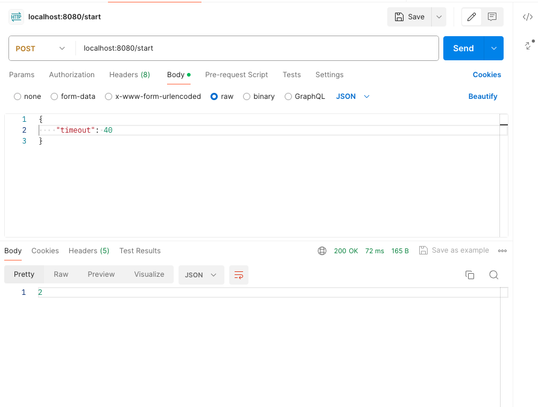
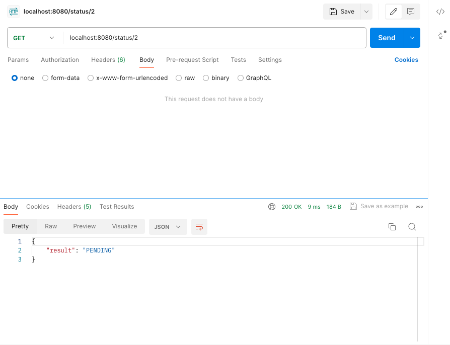
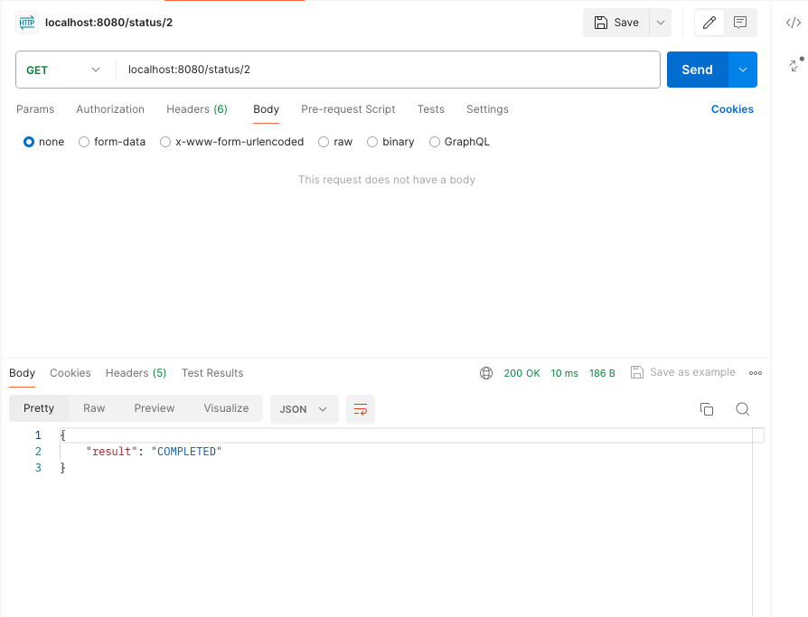
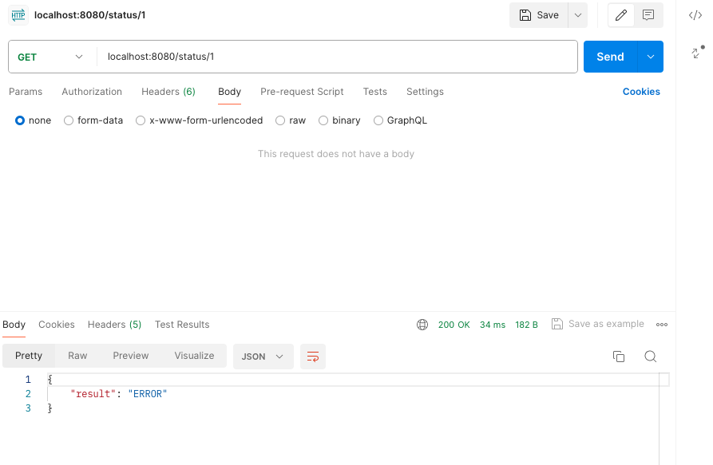

# Job Status API

Job Status API is a Spring Boot application that provides an API for managing and retrieving the status of jobs. It allows clients to start new jobs, check the current status of a job, and efficiently access job status information using caching mechanisms.
The purpose of this API is to simulate the behavior of a video translation server.

## Features

- **Job Status Management**: Start new jobs and retrieve their current status (pending, completed, or error).
- **Caching**: Efficient job status retrieval with caching mechanisms implemented using Guava Cache.
- **Database Integration**: Job status information is persisted in H2 database using JPA.
- **Provider-Library Architecture**: The project follows the Provider-Library architecture pattern, separating the core job status API from the client-facing library (`JobStatusClient`).
- **Third-Party Integration**: The `JobStatusClient` interface can be easily integration with third-party applications.

## Getting Started

### Prerequisites

- Java 8 or higher (I use Java 17 for this project)
- Make sure maven is installed and set up on your machine

### Building and Running

1. Clone the repository
2. Configure the database connection:
    - Open the `application.properties` file in the `src/main/resources` directory.
    - Update the database connection properties (e.g., `spring.datasource.url`, `spring.datasource.username`, `spring.datasource.password`) to match your database configuration.
    - P.S. In this project, I'm using a runtime H2 database for demo purposes and have not set up username and password for DB connection.
    - To access the H2 console, go to http://localhost:8080/h2-console once app is running
    - Make sure `spring.datasource.url` is set correctly in H2 console after app is running
    - 

3. Build the project: `mvn clean install`. You should see 4 jobs being created one by one in the IDE console. That is because I included
a command line runner in the main application, it will run when the application starts. In the command line runner, 3 jobs will be created and their
status will be retrieved. The remaining one is from the `src/test/java/com/zx/demo/IntegrationTest.java`. **P.S.** 3 is just an arbitrary number and 
the command line runner is to simulate third party developers creating jobs and retrieving job status.
4. Run the application: `mvn spring-boot:run`, the integration test will not run for this command, so you should see 3 jobs in the IDE console.
5. Once the app is running, you should see jobs records in H2 database console
    - 


The application should now be running on `http://localhost:8080`.

### API Endpoints

- `POST /start`: Start a new job.
- `GET /status/{jobId}`: Retrieve the current status of a job.

### Testing API Endpoints
You can comment out the commandline runner in `DemoApplication` and use Postman to test the API endpoints so that you don't need to wait for the command line runner to finish.

#### POST
Pass in a raw json data to specify how long will the new job take to be finished. You will get a response indicating the job ID.


#### GET
Pending if the job is not finished:
  

Completed if the job is finished without error:
  

Error handling is also supported:
  


### Using the JobStatusClient

The `JobStatusClient` interface provides a client-facing library for interacting with the Job Status API. Once this API project is published to maven repository it can be used by third-party applications to start new jobs and retrieve job status information.
Here are some sample code to start with:
```java
import com.zx.demo.client.*;
import com.zx.demo.data.*;

public class ThirdPartyApp {
    private JobStatusClient jobStatusClient;

    public ThirdPartyApp(JobStatusClient jobStatusClient) {
        this.jobStatusClient = jobStatusClient;
    }

    public void checkJobStatus(long jobId) {
        JobStatus status = jobStatusClient.getJobStatus(jobId);
        System.out.println("Job status: " + status);
    }

    public long startJob() {
        return jobStatusClient.startJob();
    }
}
```
### Cache
One potential issue is identified before implementing this project: **Third party user of this project might call the API repeatedly. If they call it very frequently then it has a cost,
if they call it too slowly it might cause unnecessary delays in getting the status.**  

To address the **"calling too frequently"** issue, I introduced a simple caching mechanisms using Guava Cache in `JobStatusClientImpl`.
The `JobStatusClientImpl` will first check the cache before making a call to the job status API. If the cached job status is still considered valid (based on the configured cache expiration time), the cached value will be returned. This will reduce the number of API calls made by the third-party users.

When the third-party user calls the `startJob()` method, the job status will be set to `JobStatus.PENDING`, and will be added to cache

By integrating with Guava Cache, the third-party users will have a more efficient and reliable way to interact with the API service.

## Future Works
- As mentioned above, the third-party users might get a delay if they call the status API too slowly. One possible solutions is to send a notification or message to the third-party application once the job is finished.
AWS SQS could be one option to implement this mechanism.
- Cloud deployment and further configuration is needed.
- For large systems, we could choose more scalable and reliable DB and Cache service like AWS RDS and Redis.
- Cache expiration time should be carefully considered bases on the overall time for a video translation to complete. Data analysis may be needed.
- A lightweight UI component could be added to make this project a fullstack.

